# LexIntel - Architecture Diagrams (Mermaid)

## 1. System Architecture Overview

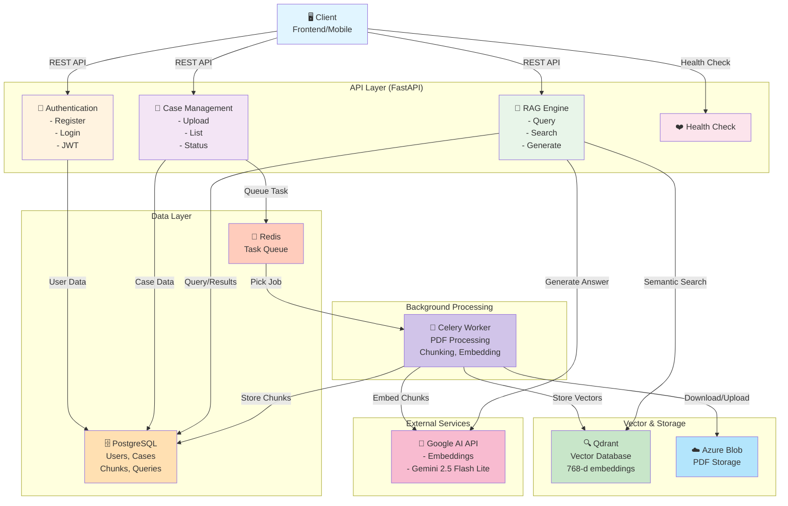

---

## 2. Document Upload & Processing Pipeline

```mermaid
graph LR
    Start([User Uploads PDF])

    Validate["✓ Validate<br/>- MIME type<br/>- Magic bytes<br/>- Filename<br/>- Case name"]

    CreateCase["Create Case<br/>status: processing"]

    UploadBlob["Upload PDF to<br/>Azure Blob<br/>cases/{case_id}/{file}"]

    QueueTask["Queue Celery Task<br/>process_document_task"]

    subgraph Worker["🔄 Background Worker"]
        Download["Download PDF<br/>from Blob"]
        Chunk["Chunk PDF<br/>1500 chars<br/>300 overlap"]
        Embed["Generate Embeddings<br/>Google AI gemini-embedding-001"]
        StorePG["Store Chunks<br/>in PostgreSQL"]
        CreateQdrant["Create Qdrant<br/>Collection"]
        Upsert["Upsert Vectors<br/>with Metadata"]
    end

    Success["✅ Success<br/>Case: processing → ready<br/>Job: completed"]

    Failure["❌ Failure<br/>Attempt++<br/>Schedule Retry<br/>0s → 5s → 10s"]

    MaxRetry{"Max Attempts<br/>Exceeded?"}

    FinalFail["Case: error<br/>Job: failed<br/>User Notified"]

    UserReady["👤 User Notified<br/>Case Ready"]

    Start --> Validate
    Validate -->|Valid| CreateCase
    Validate -->|Invalid| Start

    CreateCase --> UploadBlob
    UploadBlob --> QueueTask
    QueueTask -->|Wait in Queue| Worker

    Download --> Chunk
    Chunk --> Embed
    Embed --> StorePG
    StorePG --> CreateQdrant
    CreateQdrant --> Upsert

    Upsert -->|Success| Success
    Upsert -->|Error| Failure

    Failure --> MaxRetry
    MaxRetry -->|No| QueueTask
    MaxRetry -->|Yes| FinalFail

    Success --> UserReady
    FinalFail --> UserReady

    style Start fill:#c8e6c9
    style Validate fill:#fff9c4
    style CreateCase fill:#ffe0b2
    style UploadBlob fill:#ffccbc
    style QueueTask fill:#f8bbd0
    style Download fill:#e1bee7
    style Chunk fill:#d1c4e9
    style Embed fill:#c5cae9
    style StorePG fill:#bbdefb
    style CreateQdrant fill:#b3e5fc
    style Upsert fill:#b2dfdb
    style Success fill:#c8e6c9
    style Failure fill:#ffccbc
    style FinalFail fill:#ffcdd2
    style UserReady fill:#c8e6c9
```

---

## 3. RAG Query Pipeline (Detailed)

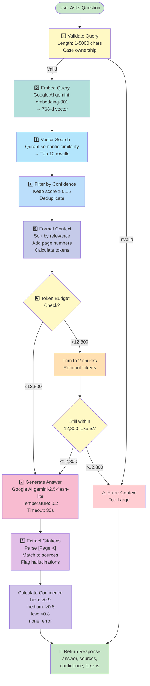

---

## 4. Data Model Relationships (ER Diagram)

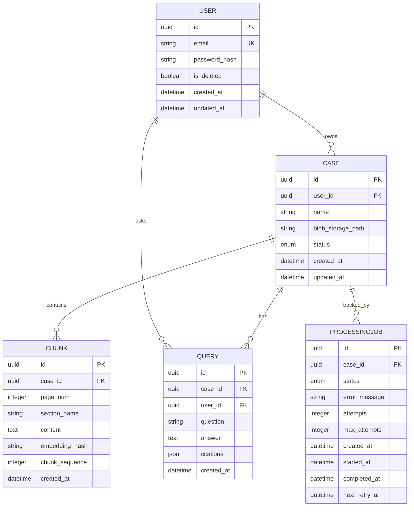

---

## 5. Authentication & Authorization Flow

```mermaid
graph TD
    Register["📝 User Registration"]
    Email["Input: email, password"]
    Validate["Validate Email<br/>Validate Password<br/>8+ chars, uppercase, digit"]
    Hash["Hash Password<br/>bcrypt(password, salt)"]
    StorePG["Store in PostgreSQL"]
    Created["✅ User Created"]

    Login["🔑 User Login"]
    LoginEmail["Input: email, password"]
    CheckEmail["Check Email Exists"]
    VerifyPass["Verify Password<br/>bcrypt.verify"]
    GenerateJWT["Generate JWT Token<br/>Payload: sub=user_id<br/>Expiry: 24 hours<br/>Algorithm: HS256"]
    ReturnToken["Return access_token"]

    Protected["🛡️ Protected Requests"]
    ExtractToken["Extract Authorization<br/>Bearer header"]
    DecodeJWT["Decode JWT<br/>Verify signature<br/>Verify expiry"]
    GetUser["Retrieve User<br/>from Database"]
    VerifyNotDeleted["Verify not deleted"]
    GrantAccess["✅ Access Granted"]

    Denied["❌ Access Denied<br/>401 Unauthorized"]

    subgraph "Registration"
        Register --> Email
        Email --> Validate
        Validate -->|Valid| Hash
        Validate -->|Invalid| Register
        Hash --> StorePG
        StorePG --> Created
    end

    subgraph "Login"
        Login --> LoginEmail
        LoginEmail --> CheckEmail
        CheckEmail -->|Exists| VerifyPass
        CheckEmail -->|Not Found| Denied
        VerifyPass -->|Match| GenerateJWT
        VerifyPass -->|No Match| Denied
        GenerateJWT --> ReturnToken
    end

    subgraph "Protected Access"
        Protected --> ExtractToken
        ExtractToken -->|No Token| Denied
        ExtractToken -->|Token Found| DecodeJWT
        DecodeJWT -->|Invalid| Denied
        DecodeJWT -->|Valid| GetUser
        GetUser --> VerifyNotDeleted
        VerifyNotDeleted -->|Deleted| Denied
        VerifyNotDeleted -->|Active| GrantAccess
    end

    style Register fill:#c8e6c9
    style Login fill:#c8e6c9
    style Protected fill:#c8e6c9
    style Created fill:#a5d6a7
    style ReturnToken fill:#a5d6a7
    style GrantAccess fill:#a5d6a7
    style Denied fill:#ffcdd2
```

---

## 6. Celery Background Job Processor

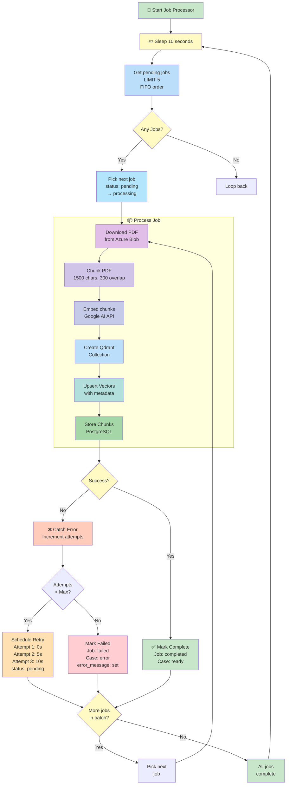

---

## 7. Component Interaction Sequence

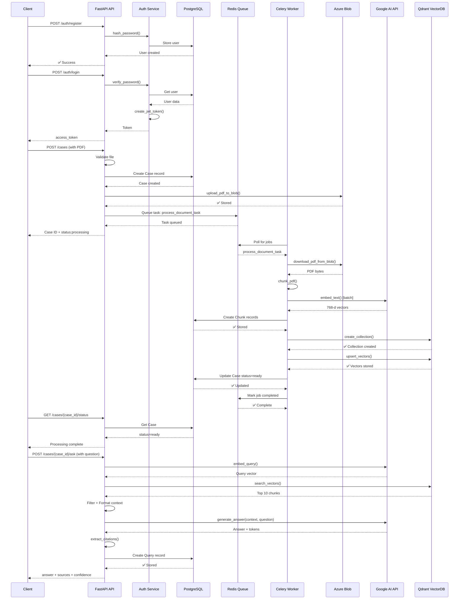

---

## 8. Token Budget Management Flow

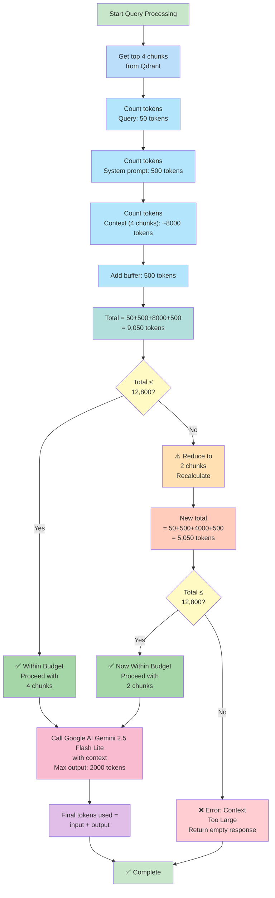

---

## 9. Horizontal Scaling Architecture

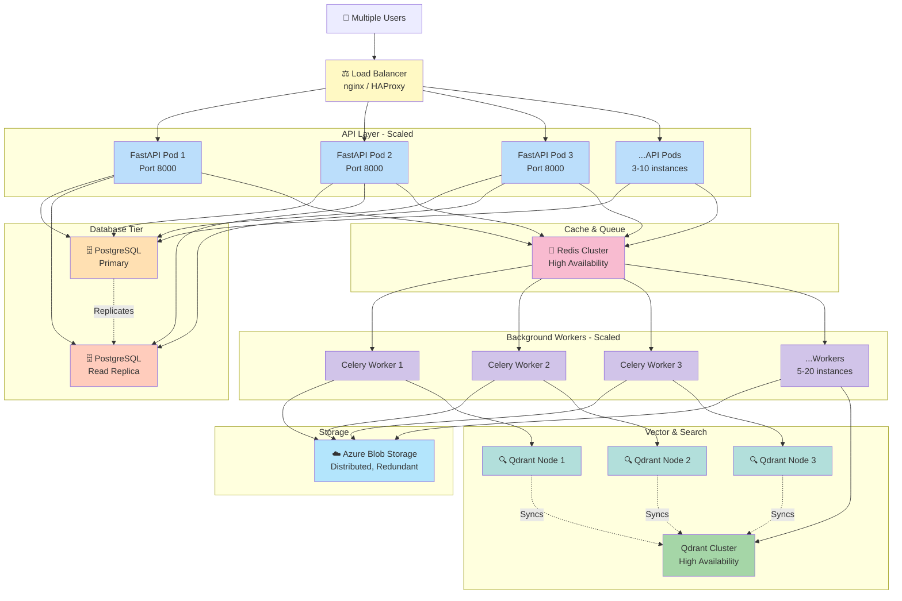

---

## 10. Error Handling & Retry Strategy

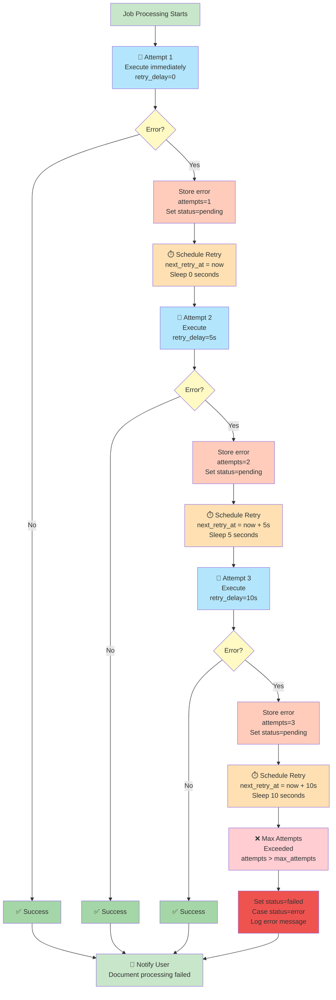

---

## 11. Security Layers

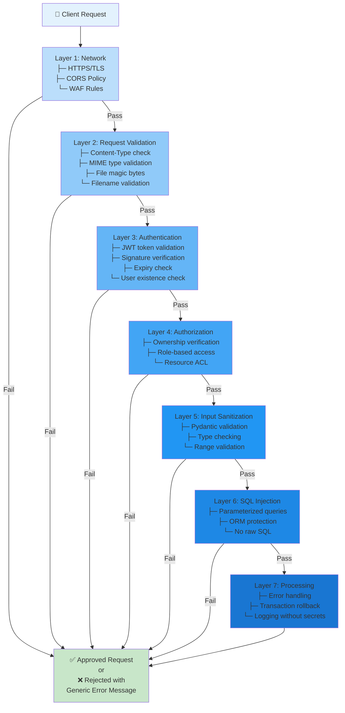

---

## 12. Deployment Pipeline (CI/CD)

```mermaid
graph LR
    Developer["👨‍💻 Developer<br/>Commits Code"]

    Git["📦 Git Repository<br/>Push to main/develop"]

    CI["🔄 CI Pipeline<br/>Tests + Lint"]

    Tests{"Tests Pass?"}

    Build["🏗️ Build Stage<br/>Docker image<br/>Push to registry"]

    Dev["🚀 Deploy Dev<br/>Docker Compose<br/>PostgreSQL, Qdrant, Redis"]

    Staging["🚀 Deploy Staging<br/>Kubernetes<br/>3x API pods<br/>3x Workers<br/>Read replicas"]

    Tests2{"Smoke Tests<br/>Pass?"}

    Prod["🚀 Deploy Production<br/>Kubernetes<br/>5-10x API pods<br/>10-20x Workers<br/>Qdrant cluster<br/>HA database"}

    Monitor["📊 Monitoring<br/>Prometheus<br/>Grafana<br/>ELK Stack"]

    Developer --> Git
    Git --> CI

    CI --> Tests
    Tests -->|Fail| Developer
    Tests -->|Pass| Build

    Build --> Dev
    Dev --> Staging
    Staging --> Tests2

    Tests2 -->|Fail| Developer
    Tests2 -->|Pass| Prod

    Prod --> Monitor

    style Developer fill:#c8e6c9
    style Git fill:#bbdefb
    style CI fill:#90caf9
    style Tests fill:#fff9c4
    style Build fill:#ffe0b2
    style Dev fill:#ffccbc
    style Staging fill:#f8bbd0
    style Tests2 fill:#fff9c4
    style Prod fill:#e1bee7
    style Monitor fill:#d1c4e9
```

---

## 13. RAG Pipeline with Confidence Scoring

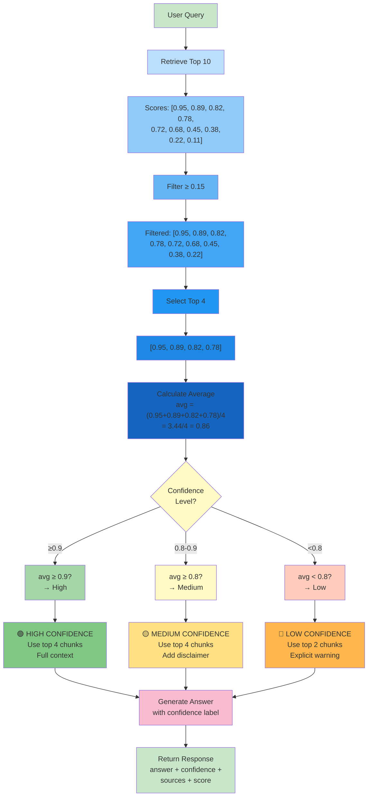

---

## Summary

These Mermaid diagrams provide:

✅ **System-level architecture** - All components and integrations
✅ **Data flow diagrams** - Upload and query pipelines
✅ **Database relationships** - ER diagram of all models
✅ **Authentication flow** - Registration to protected requests
✅ **Job processing** - Background worker loop with retries
✅ **Sequence diagrams** - Component interactions over time
✅ **Token management** - Budget checking and trimming logic
✅ **Scaling architecture** - Horizontal scaling strategy
✅ **Error handling** - Retry strategy with exponential backoff
✅ **Security layers** - Multi-layer validation approach
✅ **CI/CD pipeline** - From dev to production
✅ **Confidence scoring** - RAG confidence calculation

All diagrams are in **Mermaid format** and can be:
- Rendered in GitHub markdown
- Exported as PNG/SVG
- Used in presentations
- Embedded in documentation
