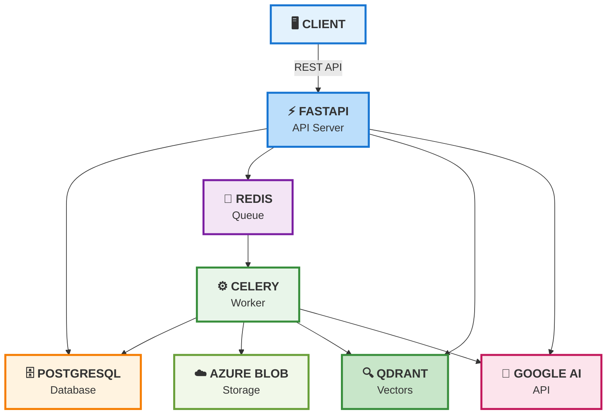
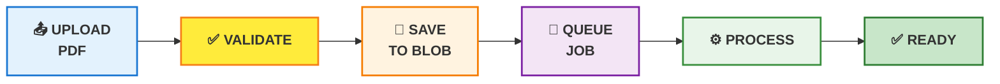
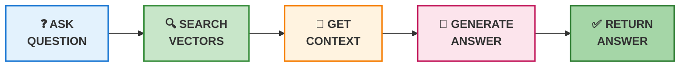
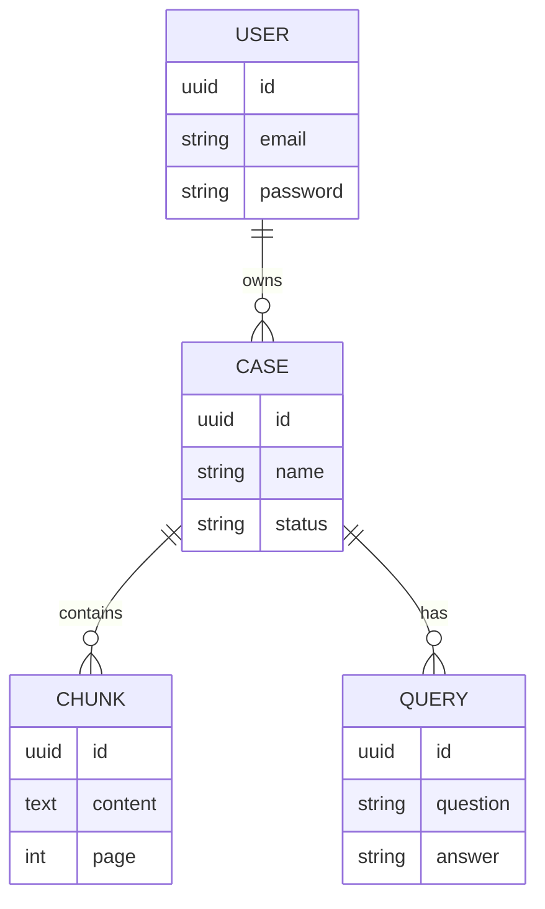
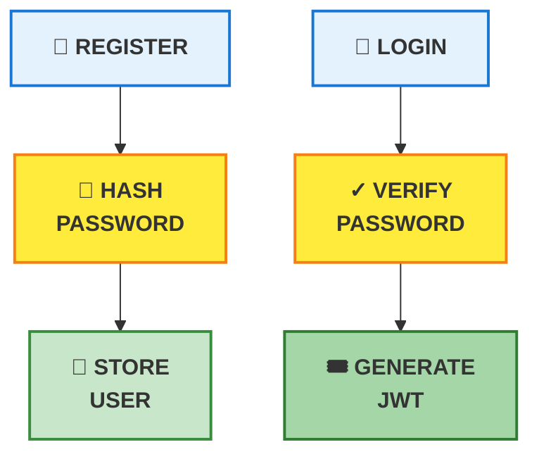
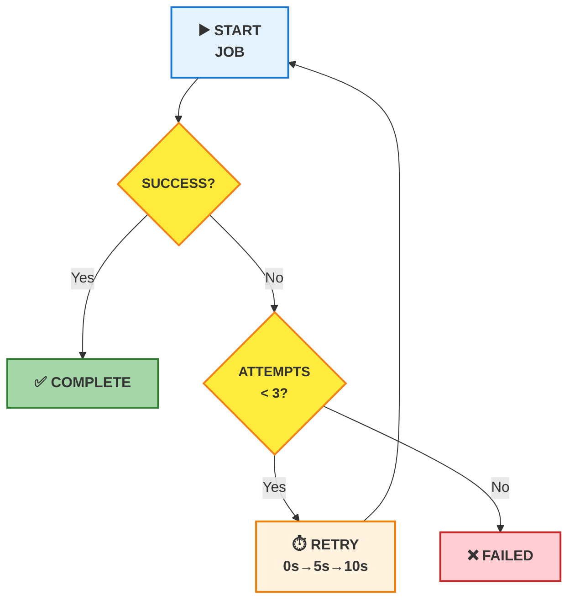
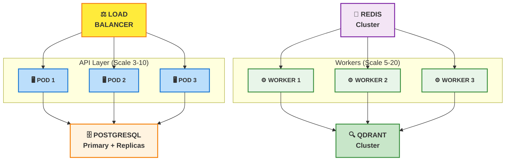

# LexIntel - Simplified Architecture

## 1. System Overview

---

## 2. Document Upload Flow

---

## 3. Query Flow

---

## 4. Data Models

---

## 5. Authentication

---

## 6. Background Job Retry

---

## 7. Scaling Strategy

---

## Key Concepts

### API Endpoints
- `POST /auth/register` - Create account
- `POST /auth/login` - Get JWT token
- `POST /cases` - Upload PDF
- `POST /cases/{id}/ask` - Ask question
- `GET /cases/{id}/status` - Check progress

### Processing Pipeline
1. **Upload** → Validate PDF → Save to Azure Blob
2. **Queue** → Background worker picks up
3. **Process** → Chunk → Embed → Store vectors
4. **Ready** → User can query

### Query Pipeline
1. **Question** → Embed to vector
2. **Search** → Find similar chunks in Qdrant
3. **Context** → Format with page numbers
4. **Generate** → Ask Gemini 2.5 Flash Lite
5. **Return** → Answer with citations

### Security
- Passwords hashed with bcrypt
- JWT tokens (24-hour expiry)
- File validation (magic bytes)
- Parameterized SQL queries
- User ownership verification

### Tech Stack
| Component | Technology |
|-----------|-----------|
| API | FastAPI |
| Database | PostgreSQL |
| Vectors | Qdrant |
| Storage | Azure Blob |
| LLM | Google Gemini |
| Embeddings | Google gemini-embedding-001 |
| Queue | Redis + Celery |
| Auth | JWT + Bcrypt |

### Performance
- Document processing: 2-3 seconds
- Query latency: 3-5 seconds
- Throughput: 30 docs/min, 100+ queries/min

### Error Handling
- Automatic retries with backoff (0s → 5s → 10s)
- Max 3 attempts per job
- Case marked as "error" on failure
- User notified of issues
