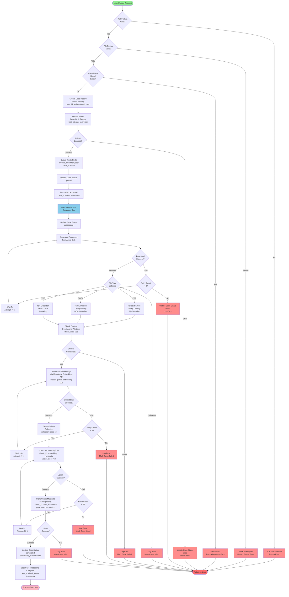
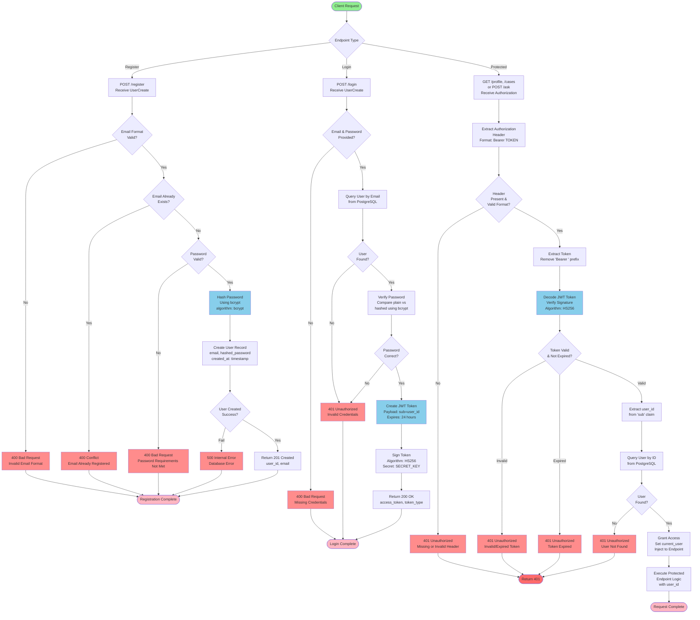
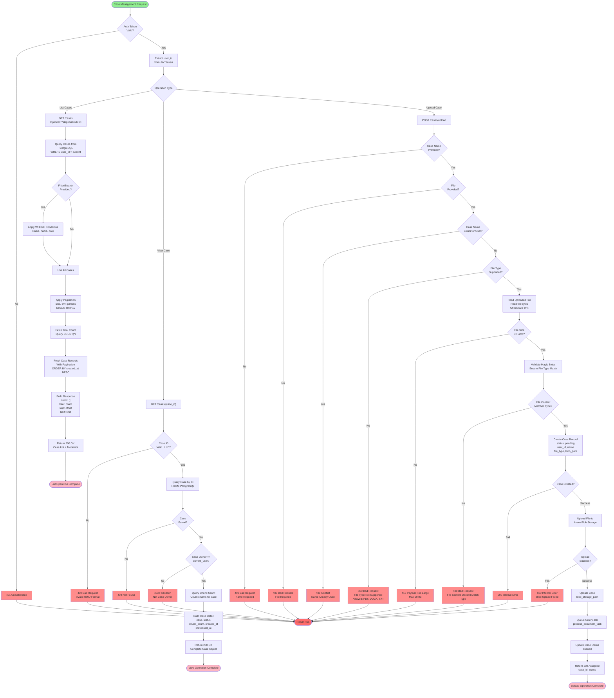
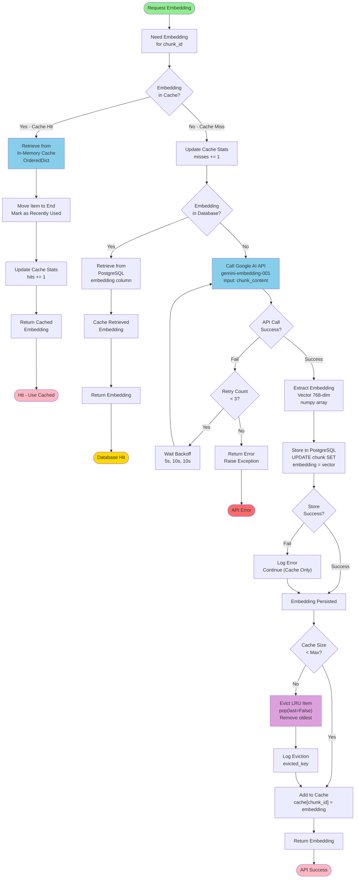
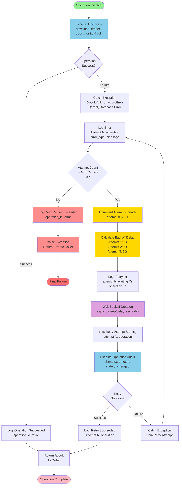

# LexIntel Process Flowcharts

This document contains comprehensive Mermaid process flowcharts for all critical flows in the LexIntel system. Each diagram illustrates decision points, error handling, and system interactions for key operations.

---

## 1. Document Upload & Processing Flow

This flow covers the complete lifecycle of a document from user upload through background processing, including Azure Blob storage, Redis queue, Celery workers, text extraction, chunking, embeddings, and vector store storage.

### Key Decision Points:
- **Auth Token Validation**: Ensures user is authenticated before accepting upload
- **File Format Validation**: Checks magic bytes (PDF, DOCX, TXT) to prevent malicious files
- **Duplicate Detection**: Prevents duplicate case names per user
- **Extraction Type Selection**: Routes to appropriate text extraction handler based on file type
- **Chunk Generation**: Validates that text extraction produced chunks
- **Retry Logic**: 3 retry attempts with exponential backoff (5s, 10s) for API calls

### Error Paths:
- Authentication failures return 401
- Format/validation errors return 400
- Upload errors are caught and case marked as failed
- Download, extraction, embedding, and storage failures trigger retry logic
- Final failure after max retries marks case as failed and logs error

---

## 2. Query & Answer Generation Flow

This flow demonstrates the complete Q&A pipeline: query validation, embedding generation, vector search, context formatting, LLM inference, and citation extraction.

```mermaid
graph TD
    Start([User Query Request]) --> Auth{Auth Token<br/>Valid?}
    Auth -->|No| AuthError["401 Unauthorized<br/>Return Error"]
    Auth -->|Yes| ValidateQuery{Query Length<br/>>= 3 chars?}

    ValidateQuery -->|No| QueryError["400 Bad Request<br/>Min 3 characters"]
    ValidateQuery -->|Yes| CheckCase{Case Found<br/>& Owned?}

    CheckCase -->|No| CaseError["404 Not Found<br/>or 403 Forbidden"]
    CheckCase -->|Yes| CheckStatus{"Case Status<br/>== completed?"}

    CheckStatus -->|No| StatusError["400 Bad Request<br/>Case Not Ready"]
    CheckStatus -->|Yes| StoreQuery["Store Query in DB<br/>case_id, user_id<br/>status: pending"]

    StoreQuery --> EmbedQuery["Generate Query Embedding<br/>Call Google AI Embedding API<br/>model: gemini-embedding-001"]

    EmbedQuery --> EmbedOK{Embedding<br/>Success?}
    EmbedOK -->|Fail| EmbedRetry{Retry Count<br/>< 3?}
    EmbedRetry -->|Yes| BackoffEmbed["Wait 10s<br/>Attempt: N+1"]
    BackoffEmbed --> EmbedQuery
    EmbedRetry -->|No| EmbedFailed["Update Query Status<br/>failed<br/>Return Error"]

    EmbedOK -->|Success| VectorSearch["Vector Search in Qdrant<br/>collection: case_id<br/>top_k: 10<br/>min_score: 0.6"]

    VectorSearch --> SearchOK{Results<br/>Found?}
    SearchOK -->|No| NoResults["Update Query Status<br/>completed<br/>answer: empty, citations: []"]
    SearchOK -->|Yes| RetrieveChunks["Retrieve Chunk Details<br/>from PostgreSQL<br/>chunk_id, content, page"]

    RetrieveChunks --> RerankChunks["Rerank Retrieved Chunks<br/>Using Similarity Scoring<br/>Select Top 4 Most Relevant"]

    RerankChunks --> FormatContext["Format Context String<br/>Concatenate Chunks<br/>Max Tokens: 12,800<br/>Include Citations: Page X"]

    FormatContext --> CountTokens["Count Tokens<br/>Using token estimation<br/>for Gemini"]

    CountTokens --> CheckTokens{Tokens<br/><= 12,800?}
    CheckTokens -->|No| TruncateContext["Truncate Context<br/>Keep Most Recent Chunks"]
    CheckTokens -->|Yes| ReadyContext["Context Ready"]
    TruncateContext --> ReadyContext

    ReadyContext --> CallLLM["Call Gemini API<br/>system: legal_prompt<br/>user: query+context<br/>max_tokens: 2000"]

    CallLLM --> LLMOk{LLM<br/>Success?}
    LLMOk -->|Fail| LLMRetry{Retry Count<br/>< 3?}
    LLMRetry -->|Yes| BackoffLLM["Wait 10s<br/>Attempt: N+1"]
    BackoffLLM --> CallLLM
    LLMRetry -->|No| LLMFailed["Update Query Status<br/>failed<br/>Return Error"]

    LLMOk -->|Success| ExtractAnswer["Extract Answer Text<br/>from LLM Response"]

    ExtractAnswer --> ExtractCitations["Extract Citations<br/>Parse [Page X] references<br/>Match with Context"]

    ExtractCitations --> ValidateCitations{"Citations<br/>Valid &<br/>Grounded?"}

    ValidateCitations -->|No| LogWarning["Log Citation Warning<br/>Store Partial Results"]
    ValidateCitations -->|Yes| ValidatedCitations["Citations Validated"]

    LogWarning --> ValidatedCitations
    ValidatedCitations --> StoreAnswer["Store Query Result<br/>answer: text<br/>citations: list<br/>context_used: chunks"]

    StoreAnswer --> UpdateQuery["Update Query Status<br/>completed<br/>completed_at: timestamp"]

    UpdateQuery --> FormatResponse["Format Response<br/>answer, citations<br/>case_id, query_id"]

    FormatResponse --> ReturnSuccess["Return 200 OK<br/>Answer + Citations"]
    ReturnSuccess --> End([Process Complete])

    AuthError --> EndError([Return Error])
    QueryError --> EndError
    CaseError --> EndError
    StatusError --> EndError
    EmbedFailed --> EndError
    NoResults --> EndFinal([Return Empty Result])
    LLMFailed --> EndError

    style Start fill:#90EE90
    style End fill:#FFB6C1
    style EndError fill:#FF6B6B
    style EndFinal fill:#FFD700
    style AuthError fill:#FF8C8C
    style QueryError fill:#FF8C8C
    style CaseError fill:#FF8C8C
    style StatusError fill:#FF8C8C
    style EmbedFailed fill:#FF8C8C
    style LLMFailed fill:#FF8C8C
    style VectorSearch fill:#87CEEB
    style CallLLM fill:#87CEEB
    style RerankChunks fill:#DDA0DD
```

### Key Decision Points:
- **Query Validation**: Enforces minimum length (3 characters)
- **Case Ownership**: Ensures user owns the case being queried
- **Case Status Check**: Only allows queries on fully processed cases
- **Embedding Success**: Retries with backoff if embedding API fails
- **Vector Search**: Minimum confidence threshold (0.6) filters weak matches
- **Token Budget**: Ensures context fits within 12,800 token budget for Gemini
- **Citation Extraction**: Parses and validates citations are grounded in context
- **Result Handling**: Returns empty results if no relevant chunks found

### Error Paths:
- Authentication and validation errors return 4xx HTTP responses
- Embedding failures trigger retry logic (3 attempts, 10s backoff)
- LLM failures trigger retry logic (3 attempts, 10s backoff)
- Citation validation warnings are logged but don't block response
- Final success includes answer and validated citations

---

## 3. User Authentication Flow

This flow covers user registration, login, and protected request authentication using JWT tokens with bcrypt password hashing and 24-hour expiry.

### Key Decision Points:
- **Registration Path**:
  - Email format validation (RFC 5322)
  - Duplicate email detection
  - Password strength validation
  - Bcrypt hashing with salt rounds

- **Login Path**:
  - Email existence check
  - Password verification using bcrypt.verify()
  - JWT creation with 24-hour expiry
  - Token signing with HS256 algorithm

- **Protected Request Path**:
  - Authorization header presence and format
  - Token decoding and signature verification
  - Token expiration check
  - User record lookup
  - Access grant to endpoint

### Error Paths:
- Validation errors return 400 Bad Request
- Duplicate email returns 409 Conflict
- Invalid/expired token returns 401 Unauthorized
- User not found returns 401 Unauthorized
- Database errors return 500 Internal Server Error

---

## 4. Case Management Flow

This flow covers case list retrieval, single case viewing, and document upload operations with ownership validation and pagination.

### Key Decision Points:
- **List Cases**:
  - Query all cases for authenticated user
  - Apply optional filters and pagination
  - Return with total count metadata

- **View Case**:
  - Validate UUID format of case_id
  - Verify case exists
  - Ensure user owns the case
  - Include chunk count in response

- **Upload Case**:
  - Validate name and file provided
  - Check name uniqueness per user
  - Validate file type (PDF, DOCX, TXT)
  - Check file size (max 50MB)
  - Validate magic bytes match file type
  - Create case record and upload to blob
  - Queue async processing job

### Error Paths:
- Authentication errors return 401
- Invalid input (name, file) returns 400
- Duplicate name returns 409 Conflict
- Not found or forbidden returns 404/403
- File validation errors return 400
- Upload failures return 500
- Async job queuing returns 202 Accepted

---

## 5. Embedding Cache Flow

This flow demonstrates the in-memory LRU cache for embeddings, including cache hits, misses, API calls, and storage with automatic eviction.

### Key Decision Points:
- **Cache Check**: Fast lookup in OrderedDict for recently used embeddings
- **Hit Path**: Move accessed item to end (most recent), increment hit counter, return
- **Miss Path**: Check PostgreSQL for previously computed embeddings
- **API Call Path**: If not cached or stored, call Google AI with retry logic
- **Size Management**: Evict LRU (oldest) item when cache reaches max_size
- **Persistence**: Always store computed embeddings in PostgreSQL for future hits

### Cache Stats:
- Track hits and misses for cache performance monitoring
- Calculate hit rate: hits / (hits + misses)
- Monitor eviction frequency to tune cache size

### Error Paths:
- API failures trigger 3 retry attempts with backoff
- Database storage failures are logged but don't block cache operations
- API final failure returns exception to caller
- Cache operations are designed to be fast with no blocking I/O

---

## 6. Retry & Error Recovery Flow

This flow demonstrates the comprehensive retry strategy with exponential backoff, max attempt limits, logging, and final error handling for transient failures in document processing and API calls.

### Retry Strategy:
- **Max Attempts**: 3 total attempts (1 initial + 2 retries)
- **Backoff Schedule**:
  - Attempt 1: Immediate execution
  - Attempt 2: Wait 5 seconds
  - Attempt 3: Wait 10 seconds
  - After 3rd failure: Raise exception

- **Operations with Retry Logic**:
  - Document download from Azure Blob
  - Embedding generation via Google AI API
  - Vector upsert to Qdrant
  - LLM call to Gemini
  - Query embedding generation

### Error Handling:
- **Transient Errors**: Network timeouts, rate limits, temporary service issues
- **Logging**: Each attempt and backoff duration logged for debugging
- **State Management**: No state changes during retries; clean idempotency
- **Final Failure**: After max retries, exception raised and case/query marked failed

### Conditions for Retry:
- **Retry**: Rate limit (429), timeout, temporary connection failure
- **No Retry**: Invalid input (400), authentication failure (401), not found (404), forbidden (403), malformed content

---

## Integration Notes

All flowcharts integrate as follows:

1. **Upload Flow** → **Document Processing Flow**: Queues job on successful upload
2. **Query Flow** → **Embedding Cache Flow**: Uses cached embeddings when available
3. **Query Flow** → **Retry Flow**: Retries failed embedding and LLM calls
4. **Case Management** → **Upload Flow**: Validates ownership before allowing upload
5. **Auth Flow** → **All Protected Flows**: Validates JWT token on all requests
6. **Processing Flow** → **Retry Flow**: Retries all external API calls with backoff

---

## Mermaid Rendering Notes

These diagrams use the following Mermaid syntax features:

- **Graph Type**: Flowchart (graph TD = top-down)
- **Node Types**:
  - Round rectangle `([text])`: Start/end nodes
  - Square `[text]`: Process nodes
  - Diamond `{text}`: Decision nodes
  - Rectangular `["text"]`: Multi-line process

- **Styling**:
  - Green fill: Start nodes
  - Pink fill: Success end nodes
  - Red fill: Error end nodes
  - Light blue: Operation/API nodes
  - Purple: Cache/backoff nodes
  - Yellow: State transition nodes

All diagrams are valid Mermaid syntax and should render correctly in GitHub Markdown, GitLab, Notion, and other Mermaid-supporting platforms.
