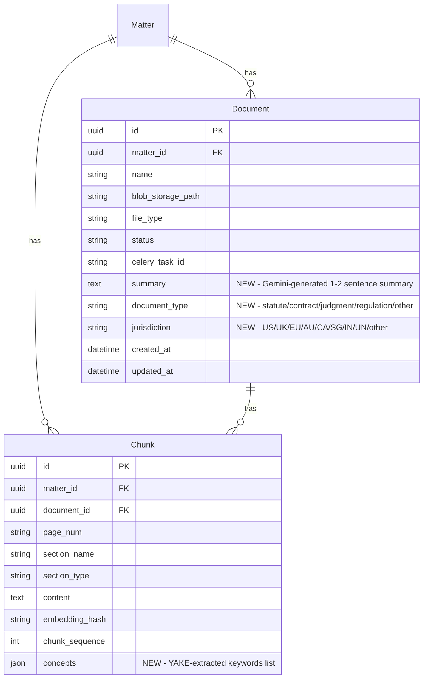

# Improve RAG Accuracy with Concept Extraction & Retrieval Enrichment

## Overview

Replace the dead hardcoded 15-term `LEGAL_TERMS` list with research-backed techniques that measurably improve legal RAG accuracy. Four phases implement YAKE keyword extraction, Summary-Augmented Chunking (SAC), document metadata enrichment, and RAG pipeline integration.

**Research basis**: Summary-Augmented Chunking reduces Document-Level Retrieval Mismatch from 95% to 19% (arXiv:2510.06999). Metadata enrichment improves Hits@10 from 74% to 90% (arXiv:2406.13213). KeyBERT/YAKE metadata adds +7.2pp accuracy (arXiv:2505.18247).

**Current state**: `document_summary.py` has a hardcoded 15-term list that is computed after answer generation, never affects retrieval/prompt/confidence, and the frontend ignores it entirely. It is dead code.

## Problem Statement

1. **Dead concept extraction**: `extract_key_concepts()` counts occurrences of 15 hardcoded terms (`payment`, `liability`, `indemnif`...) using `\b{term}\b` regex. Two terms (`indemnif`, `terminat`) are stems that never match anything. The function is called at query-time but its output is never displayed or used.

2. **No document-level context in embeddings**: Each chunk is embedded in isolation. When a matter has multiple documents, the retriever cannot distinguish which document a chunk belongs to semantically — Document-Level Retrieval Mismatch reaches 95% on legal corpora.

3. **No document classification or jurisdiction awareness**: The retriever treats a US contract and a UK statute identically. No metadata-based filtering is possible.

4. **Legal vocabulary is unbounded**: Black's Law Dictionary has 55,000+ terms; Westlaw's taxonomy has 110,000+ topics. A hardcoded list captures 0.03% of legal vocabulary.

## Proposed Solution

### Architecture Diagram

```
INGESTION (tasks.py)

  blob_content
       |
  [1] extract_text()
       |
  extracted_sections
       |
  [2] chunk_document_from_blob()
       |
  raw_chunks
       |
  [3] NEW: generate_doc_summary()  ──> Document.summary
      + classify_document()        ──> Document.document_type
                                       Document.jurisdiction
       |                           (Gemini Flash, parallel)
       |
  [4] NEW: extract_chunk_keywords()──> chunk["concepts"]
       |                           (YAKE, local, fast)
       |
  [5] Store chunks in PostgreSQL   ──> Chunk.concepts (JSON)
       |
  [6] Prepare embedding text:
      embed_text = f"{summary}\n{chunk.content}"  (SAC)
       |
  [7] embed_chunks(embed_texts)    ──> 1024-dim vectors
       |
  [8] upsert_vectors() with enriched payload:
      + concepts, document_type, jurisdiction
       |
  [9] Update Document + Matter status


QUERY (rag_engine.py)

  user_query
       |
  [1] embed_query()
       |
  [2] search_vectors() ──> optional filters:
      document_type, jurisdiction (auto-detected from query)
       |
  [3] rerank_chunks() (cross-encoder, unchanged)
       |
  [4] format_legal_context()
      + NEW: include document summaries as preamble
       |
  [5] generate_answer() (Gemini, unchanged)
       |
  [6] extract_citations + confidence (unchanged)
       |
  [7] generate_document_summary()
      NOW: reads pre-computed metadata from DB
```

## Technical Approach

### Phase 1: YAKE Keyword Extraction at Ingestion

**Goal**: Replace hardcoded LEGAL_TERMS with automatic, unbounded keyword extraction. Zero API cost, ~10ms per chunk.

#### 1.1 New service: `backend/services/keyword_extractor.py`

```python
"""Unsupervised keyword extraction using YAKE."""
import yake
import logging
from typing import List, Dict

logger = logging.getLogger(__name__)

# YAKE configuration optimized for legal text
YAKE_LANGUAGE = "en"
YAKE_MAX_NGRAM = 3        # Capture multi-word legal terms ("force majeure", "intellectual property")
YAKE_DEDUP_THRESHOLD = 0.9 # Deduplicate similar phrases
YAKE_TOP_KEYWORDS = 10     # Extract top 10 per chunk
YAKE_SCORE_THRESHOLD = 0.2 # Lower = more relevant (YAKE inverts scores)

_extractor = None

def _get_extractor() -> yake.KeywordExtractor:
    """Singleton YAKE extractor (reused across chunks)."""
    global _extractor
    if _extractor is None:
        _extractor = yake.KeywordExtractor(
            lan=YAKE_LANGUAGE,
            n=YAKE_MAX_NGRAM,
            dedupLim=YAKE_DEDUP_THRESHOLD,
            top=YAKE_TOP_KEYWORDS,
            features=None,  # Use default statistical features
        )
    return _extractor


def extract_chunk_keywords(text: str) -> List[str]:
    """Extract keywords from a single chunk. Returns lowercased, deduplicated terms."""
    if not text or len(text.strip()) < 30:
        return []
    try:
        extractor = _get_extractor()
        keywords = extractor.extract_keywords(text)
        # YAKE score: lower = more relevant. Filter by threshold.
        return [kw.lower() for kw, score in keywords if score < YAKE_SCORE_THRESHOLD]
    except Exception as e:
        logger.warning(f"YAKE extraction failed: {e}")
        return []


```

#### 1.2 Add `concepts` column to Chunk model

```python
# backend/models.py — Chunk model
concepts = Column(JSON, nullable=True, default=list)  # YAKE-extracted keywords
```

#### 1.3 Alembic migration: `8_add_concept_and_metadata_fields.py`

```python
revision = "8"
down_revision = "7"

def upgrade():
    # Chunk: add concepts JSON column
    op.add_column("chunks", sa.Column("concepts", sa.JSON, nullable=True))

    # Document: add summary, document_type, jurisdiction
    op.add_column("documents", sa.Column("summary", sa.Text, nullable=True))
    op.add_column("documents", sa.Column("document_type", sa.String(100), nullable=True))
    op.add_column("documents", sa.Column("jurisdiction", sa.String(100), nullable=True))

def downgrade():
    op.drop_column("chunks", "concepts")
    op.drop_column("documents", "summary")
    op.drop_column("documents", "document_type")
    op.drop_column("documents", "jurisdiction")
```

#### 1.4 Integrate into `tasks.py` pipeline

Insert YAKE extraction between chunking and DB storage:

```python
# After step 2 (chunking), before step 3 (DB storage):
from services.keyword_extractor import extract_chunk_keywords

for chunk in chunks:
    chunk["concepts"] = extract_chunk_keywords(chunk["content"])
```

Store concepts in both PostgreSQL (Chunk.concepts) and Qdrant payload.

#### 1.5 Update Qdrant payload in `vector_store.py`

Add `concepts` to `upsert_vectors()` metadata dict and `search_vectors()` result dict. Add KEYWORD payload index in `create_collection()`.

#### 1.6 Rewrite `document_summary.py`

Replace `extract_key_concepts()` to read pre-computed YAKE concepts from DB instead of running regex at query time. Fallback to empty list for old documents.

#### 1.7 Update frontend

- Add `concepts` to `ChunkResponse` type in `frontend/lib/types.ts`
- Add `keywords`, `document_type`, `jurisdiction`, `summary` to `DocumentResponse` in `frontend/lib/api-services.ts`
- Display concepts as styled tags in document detail view

#### 1.8 Add `yake` to requirements.txt

```
# Keyword Extraction
yake>=0.4.8
```

---

### Phase 2: Summary-Augmented Chunking (SAC)

**Goal**: Inject document-level context into the embedding space. Each chunk carries a signal about what document it belongs to, dramatically improving retrieval precision for multi-document matters.

**Critical design decision**: The summary is prepended to chunk text **only for embedding**. The original chunk content is stored in PostgreSQL and Qdrant payload unchanged. This avoids:
- Wasting storage (summary repeated N times)
- Blowing the LLM token budget (summary repeated in every excerpt)
- Pushing chunk content out of the cross-encoder's 512-token window

#### 2.1 New function in `document_summary.py`

```python
async def generate_doc_summary(extracted_text: str) -> str | None:
    """Generate a 1-2 sentence document summary using Gemini.

    Args:
        extracted_text: First ~30,000 chars of document text

    Returns:
        Summary string, or None if generation fails (graceful degradation)
    """
    import google.generativeai as genai

    settings = get_settings()
    if not settings.google_api_key:
        return None

    genai.configure(api_key=settings.google_api_key)
    model = genai.GenerativeModel(model_name=settings.gemini_model)

    # Truncate to first ~30,000 chars (covers preamble, TOC, key sections)
    truncated = extracted_text[:30000]

    prompt = (
        "Summarize this legal document in exactly 1-2 sentences. "
        "Include the document type, subject matter, and key parties if identifiable. "
        "Be factual and specific.\n\n"
        f"{truncated}"
    )

    try:
        response = await model.generate_content_async(
            prompt,
            generation_config=genai.GenerationConfig(
                temperature=0.1,
                max_output_tokens=100,
            ),
        )
        summary = response.text.strip()
        # Cap at 200 chars to limit embedding prefix size
        return summary[:200] if summary else None
    except Exception as e:
        logger.warning(f"Summary generation failed (graceful degradation): {e}")
        return None
```

#### 2.2 Modify embedding step in `tasks.py`

The current `embed_chunks()` in `embeddings.py` accepts a list of text strings and returns embeddings. The SAC change prepends the summary before passing texts to `embed_chunks`, while storing the original content separately:

```python
# After summary generation, before embedding:
# Build the texts to embed (summary-augmented) separately from stored content
embed_texts = []
for chunk in chunks:
    if doc_summary:
        embed_texts.append(f"{doc_summary}\n{chunk['content']}")
    else:
        embed_texts.append(chunk["content"])

# Embed the summary-augmented texts (1024-dim vectors)
embeddings = embed_chunks(embed_texts)

# Store ORIGINAL content in PostgreSQL and Qdrant (not the augmented text)
# The summary lives only in the embedding vector space
```

**Confirmed**: `embed_chunks(chunks: List[str])` already accepts plain text strings (`embeddings.py:174`). No wrapper needed.

#### 2.3 Store summary in Document model

```python
# backend/models.py — Document model
summary = Column(Text, nullable=True)
```

Already included in the Phase 1 migration (8_add_concept_and_metadata_fields.py).

#### 2.4 Failure mode

If Gemini is unavailable during summary generation:
- Log warning
- Proceed without summary prefix (chunks embedded as-is)
- Store `Document.summary = None`
- Document is fully functional for RAG, just without the SAC improvement

---

### Phase 3: Document Metadata Enrichment

**Goal**: Classify each document by type and jurisdiction at ingestion time. Store as filterable Qdrant payload fields.

#### 3.1 New function in `document_summary.py`

```python
async def classify_document(extracted_text: str) -> dict:
    """Classify document type and jurisdiction using Gemini.

    Returns:
        Dict with keys: document_type, jurisdiction
        Falls back to {"document_type": "other", "jurisdiction": "unknown"}
    """
    import google.generativeai as genai

    settings = get_settings()
    if not settings.google_api_key:
        return {"document_type": "other", "jurisdiction": "unknown"}

    genai.configure(api_key=settings.google_api_key)
    model = genai.GenerativeModel(model_name=settings.gemini_model)

    truncated = extracted_text[:10000]  # Classification needs less text

    prompt = (
        "Classify this legal document. Respond with ONLY two lines:\n"
        "TYPE: <one of: statute, contract, judgment, regulation, pleading, policy, other>\n"
        "JURISDICTION: <one of: US, UK, EU, AU, CA, SG, IN, UN, other>\n\n"
        f"{truncated}"
    )

    try:
        response = await model.generate_content_async(
            prompt,
            generation_config=genai.GenerationConfig(
                temperature=0.0,
                max_output_tokens=50,
            ),
        )
        text = response.text.strip()
        doc_type = "other"
        jurisdiction = "unknown"
        for line in text.split("\n"):
            if line.upper().startswith("TYPE:"):
                doc_type = line.split(":", 1)[1].strip().lower()
            elif line.upper().startswith("JURISDICTION:"):
                jurisdiction = line.split(":", 1)[1].strip().upper()
        return {"document_type": doc_type, "jurisdiction": jurisdiction}
    except Exception as e:
        logger.warning(f"Document classification failed (graceful degradation): {e}")
        return {"document_type": "other", "jurisdiction": "unknown"}
```

#### 3.2 Integrate into `tasks.py`

Run summary generation and classification **in parallel** (they are independent):

```python
import asyncio

# After text extraction, before chunking:
full_text = "\n".join(s.get("content", "") for s in extracted_sections)

# Run both API calls concurrently
doc_summary, classification = await asyncio.gather(
    generate_doc_summary(full_text),
    classify_document(full_text),
)

# Store in Document record
document.summary = doc_summary
document.document_type = classification["document_type"]
document.jurisdiction = classification["jurisdiction"]
db.commit()
```

Note: `process_document_task` is a Celery task running in a **prefork** worker pool (confirmed by PID checks in chunking.py). Use `asyncio.run()` to execute the async Gemini calls — this is safe because prefork workers don't have a pre-existing event loop:

```python
import asyncio

async def _enrich_document(full_text):
    return await asyncio.gather(
        generate_doc_summary(full_text),
        classify_document(full_text),
    )

doc_summary, classification = asyncio.run(_enrich_document(full_text))
```

**Assumption**: Celery uses prefork pool (not gevent/eventlet). If the pool changes, this needs to use `loop.run_until_complete()` with a new loop instead.

#### 3.3 Add Qdrant payload fields and indexes

In `vector_store.py`:

```python
# In upsert_vectors() metadata dict:
"document_type": str(chunk.get("document_type", "")),
"jurisdiction": str(chunk.get("jurisdiction", "")),
"concepts": chunk.get("concepts", []),

# In create_collection(), add new payload indexes:
client.create_payload_index(
    collection_name=collection_name,
    field_name="document_type",
    field_schema=PayloadSchemaType.KEYWORD
)
client.create_payload_index(
    collection_name=collection_name,
    field_name="jurisdiction",
    field_schema=PayloadSchemaType.KEYWORD
)
```

#### 3.4 Ensure idempotent index creation

Update `create_collection()` to add indexes to existing collections. Qdrant's `create_payload_index` is idempotent — calling it on an existing index is a no-op (verified in Qdrant docs). Wrap in try/except as defensive measure:

```python
def _ensure_payload_indexes(client, collection_name):
    """Create payload indexes if they don't exist. Safe to call on existing collections."""
    index_fields = {
        "page_num": PayloadSchemaType.KEYWORD,
        "section_name": PayloadSchemaType.KEYWORD,
        "document_type": PayloadSchemaType.KEYWORD,
        "jurisdiction": PayloadSchemaType.KEYWORD,
    }
    for field, schema in index_fields.items():
        try:
            client.create_payload_index(
                collection_name=collection_name,
                field_name=field,
                field_schema=schema,
            )
        except Exception:
            pass  # Index already exists or field not populated yet
```

Call this in `create_collection()` for both new and existing collections.

---

### Phase 4: RAG Pipeline Integration

**Goal**: Make the extracted metadata and summaries actively improve retrieval and answer quality.

#### 4.1 Add document summaries to LLM context

The summary is stored in PostgreSQL's Document model, NOT in Qdrant payload (to avoid repeating it per-chunk). Fetch it via a DB query in `query_matter()` and pass to `format_legal_context()`:

```python
# In query_matter(), after retrieving chunks:
# Collect unique document IDs from retrieved chunks
doc_ids = {UUID(c["document_id"]) for c in final_chunks if c.get("document_id")}
doc_summaries = {}
if doc_ids:
    docs = db.query(Document).filter(Document.id.in_(doc_ids)).all()
    doc_summaries = {str(d.id): {"name": d.name, "summary": d.summary} for d in docs if d.summary}

# Pass to format_legal_context()
formatted_context = format_legal_context(final_chunks, matter.name, doc_summaries)
```

In `format_legal_context()`:

```python
def format_legal_context(chunks, matter_name, doc_summaries=None):
    # Add document summaries as preamble (once per document, not per chunk)
    if doc_summaries:
        context_parts.append("Document Summaries:\n")
        for doc_id, info in doc_summaries.items():
            context_parts.append(f"  - {info['name']}: {info['summary']}\n")
        context_parts.append("\n")
```

#### 4.2 Optional pre-retrieval filtering

In `rag_engine.py`, add lightweight query analysis to detect jurisdiction/type hints:

```python
def _detect_query_filters(query: str) -> dict:
    """Detect optional Qdrant filters from query text."""
    filters = {}
    query_lower = query.lower()

    # Jurisdiction detection (explicit mentions only)
    jurisdiction_hints = {
        "UK": ["uk ", "united kingdom", "english law", "british"],
        "US": ["us ", "united states", "american", "federal"],
        "EU": ["eu ", "european union", "gdpr", "directive"],
    }
    for code, hints in jurisdiction_hints.items():
        if any(h in query_lower for h in hints):
            filters["jurisdiction"] = code
            break

    return filters  # Empty dict = no filters applied
```

Pass filters to `search_vectors()` which applies them as Qdrant payload conditions. If filtered search returns < 3 results, **automatically fall back to unfiltered** and log a note.

#### 4.3 Rewrite `generate_document_summary()`

Replace query-time regex computation with DB read:

```python
def generate_document_summary(matter) -> Dict[str, Any]:
    """Read pre-computed document metadata from the database."""
    documents = getattr(matter, 'documents', []) or []

    # Aggregate concepts from all documents' chunks
    all_concepts = Counter()
    for doc in documents:
        for chunk in getattr(doc, 'chunks', []):
            for concept in (getattr(chunk, 'concepts', None) or []):
                all_concepts[concept] += 1

    top_concepts = [c for c, _ in all_concepts.most_common(10)]

    # Use first document's metadata as primary classification
    primary_doc = documents[0] if documents else None

    return {
        "filename": getattr(matter, 'name', 'Unknown'),
        "file_type": getattr(matter, 'file_type', 'unknown'),
        "key_concepts": top_concepts,
        "legal_significance": getattr(primary_doc, 'document_type', 'Legal Document') if primary_doc else 'Legal Document',
        "total_pages": calculate_page_count(matter),
        "processing_status": getattr(matter, 'status', 'unknown'),
        "processed_at": updated_at.isoformat() if (updated_at := getattr(matter, 'updated_at', None)) and hasattr(updated_at, 'isoformat') else None,
    }
```

---

## ERD: Model Changes



---

## Implementation Phases

### Phase 1: YAKE + DB Schema + Dead Code Removal

**Scope**: Backend + frontend. No Gemini API calls. YAKE runs locally.

#### Backend
- [x] Add `yake>=0.4.8` to `backend/requirements.txt`
- [x] Create `backend/services/keyword_extractor.py` (extract_chunk_keywords)
- [x] Add `concepts` column to Chunk model in `backend/models.py`
- [x] Add `summary`, `document_type`, `jurisdiction` columns to Document model in `backend/models.py`
- [x] Create Alembic migration `8_add_concept_and_metadata_fields.py`
- [x] Integrate YAKE into `process_document_task()` in `backend/tasks.py` (between chunking and DB storage)
- [x] Add `concepts` to Qdrant payload in `backend/services/vector_store.py` (upsert + search)
- [x] Rewrite `backend/services/document_summary.py`: remove `LEGAL_TERMS`, `extract_key_concepts()` reads from DB
- [x] Add new Document fields to `GET /matters/{id}/documents` response in `backend/main.py`

#### Frontend
- [x] Update `DocumentResponse` in `frontend/lib/api-services.ts` (add summary, document_type, jurisdiction, keywords)
- [x] Update `ChunkResponse` in `frontend/lib/types.ts` (add concepts)
- [x] Add concepts display in document detail view

#### Tests
- [x] Verify YAKE extracts meaningful terms from legal PDFs
- [ ] Verify old documents without concepts still work (graceful fallback)

**Estimated effort**: Small-Medium

### Phase 2: Summary-Augmented Chunking (SAC)

**Scope**: Backend + Gemini API call during ingestion

- [x] Add `generate_doc_summary()` async function to `backend/services/document_summary.py`
- [x] Modify `process_document_task()` in `backend/tasks.py`: call summary generation after text extraction
- [x] Modify embedding step: prepend summary to chunk text for embedding ONLY (not for storage)
- [x] Store `Document.summary` in PostgreSQL
- [x] Add progress event for summary generation stage in `backend/services/progress.py`
- [x] Handle Gemini failure: graceful degradation (proceed without summary)
- [ ] Test: verify SAC chunks produce higher retrieval scores for cross-document queries
- [ ] Test: verify embedding dimensions unchanged (1024-dim)
- [ ] Test: verify original chunk content stored (not summary-augmented)

**Estimated effort**: Medium

### Phase 3: Document Metadata Enrichment

**Scope**: Backend + Gemini API call during ingestion + Qdrant filtering

- [x] Add `classify_document()` async function to `backend/services/document_summary.py`
- [x] Run classification in parallel with summary generation (asyncio.gather)
- [x] Store `Document.document_type` and `Document.jurisdiction` in PostgreSQL
- [x] Add `document_type`, `jurisdiction` to Qdrant payload in `backend/services/vector_store.py`
- [x] Add KEYWORD payload indexes for `document_type` and `jurisdiction` in `create_collection()`
- [x] Add idempotent index creation for existing collections
- [x] Add `_detect_query_filters()` to `backend/services/rag_engine.py`
- [x] Add filtered search support to `search_vectors()` in `backend/services/vector_store.py`
- [x] Add fallback: if filtered search returns < 3 results, retry unfiltered
- [x] Display document_type and jurisdiction in frontend document list
- [ ] Test: verify classification accuracy on sample legal documents
- [ ] Test: verify filtered search improves precision for jurisdiction-specific queries
- [ ] Test: verify fallback works when filter returns too few results

**Estimated effort**: Medium

### Phase 4: RAG Pipeline Integration

**Scope**: Backend query path changes

- [x] Add document summaries to `format_legal_context()` in `backend/services/rag_engine.py`
- [x] Fetch document summaries from PostgreSQL in `query_matter()` (by document_id from retrieved chunks)
- [x] Update `generate_document_summary()` to read all metadata from DB (no more regex)
- [ ] Remove `classify_legal_document_type()` regex-based classifier (replaced by Gemini classification)
- [ ] Update frontend `AskResponse` type to include enriched `source_document`
- [ ] Test: verify document summaries appear in LLM context
- [ ] Test: verify confidence scoring is stable
- [ ] Test: full E2E with all phases enabled

**Estimated effort**: Small

---

## Alternative Approaches Considered

### 1. KeyBERT instead of YAKE
- **Pro**: Semantic understanding, better accuracy
- **Con**: Requires model loading (~500ms startup), 1-2 seconds per chunk (vs 10ms for YAKE)
- **Decision**: YAKE chosen for speed. KeyBERT can be added later as an optional upgrade.

### 2. LLM-based concept extraction (Gemini per chunk)
- **Pro**: Best accuracy, jurisdiction-aware
- **Con**: 1-2 seconds per chunk, $0.001-0.01 per chunk. For 1,500 chunks: 25-50 minutes and $1.50-15
- **Decision**: Too expensive for per-chunk. Used only for document-level tasks (summary, classification).

### 3. BM25 hybrid retrieval
- **Pro**: Research shows 71% to 87-91% accuracy improvement for hybrid vs dense-only
- **Con**: Requires separate BM25 index infrastructure, significant architectural change
- **Decision**: Deferred to a future phase. The current Cohere + cross-encoder reranking already provides hybrid-like benefits.

### 4. Legal NER (Blackstone, Legal-BERT)
- **Pro**: Extracts structured entities (case names, statutes, parties)
- **Con**: Jurisdiction-specific models (Blackstone = UK only), 70% F1, heavyweight dependencies
- **Decision**: Deferred. YAKE + Gemini classification covers the primary use case.

---

## Acceptance Criteria

### Functional Requirements

- [ ] New documents get YAKE keywords extracted (5-10 per chunk, visible in UI)
- [ ] New documents get a 1-2 sentence Gemini summary stored in Document model
- [ ] New documents get document_type and jurisdiction classification
- [ ] Summary is prepended to chunk text for embedding but NOT stored as part of chunk content
- [ ] Qdrant payload includes `concepts`, `document_type`, `jurisdiction` fields
- [ ] `generate_document_summary()` reads from DB, not from hardcoded regex
- [ ] Frontend displays key concepts, document type, and jurisdiction
- [ ] Old documents (pre-feature) continue to work with graceful fallback (empty concepts, null summary)
- [ ] SAC and metadata enrichment apply to newly uploaded documents only. Existing documents retain their original embeddings until re-processed (see Future Considerations #2)

### Non-Functional Requirements

- [ ] YAKE extraction adds < 20 seconds for a 1,500-chunk document
- [ ] Gemini summary + classification adds < 5 seconds per document
- [ ] Total ingestion pipeline increase < 25 seconds per document
- [ ] Gemini failure does not block document processing (graceful degradation)
- [ ] Zero increase in per-query latency (all enrichment happens at ingestion time)

### Quality Gates

- [ ] All existing E2E tests pass (test_e2e_full_rag.py, test_real_e2e_rag.py)
- [ ] New tests for YAKE extraction, SAC embedding, classification, filtered search
- [ ] Alembic migration is reversible (downgrade works)

---

## Risk Analysis & Mitigation

| Risk | Probability | Impact | Mitigation |
|------|------------|--------|------------|
| Gemini unavailable during ingestion | Medium | Medium | Graceful degradation: proceed without summary/classification |
| YAKE produces low-quality keywords | Low | Low | YAKE threshold tuning, keywords are supplementary not critical |
| SAC degrades cross-document retrieval for mixed old/new vectors | Medium | High | SAC only applies to new docs; provide re-processing endpoint |
| Classification misidentifies document type | Medium | Low | Classification is advisory, not blocking; user can see it in UI |
| Existing Qdrant collections lack new indexes | High | Medium | Idempotent index creation in `create_collection()` |
| YAKE dependency conflicts | Low | Low | YAKE is pure Python, minimal dependencies |

---

## Dependencies & Prerequisites

- `yake>=0.4.8` (pure Python, no native deps)
- Gemini API key already configured (`settings.google_api_key`)
- Cohere API key already configured (`settings.cohere_api_key`)
- Qdrant already deployed and accessible
- PostgreSQL with Alembic migrations

---

## Future Considerations

1. **BM25 hybrid retrieval**: Add parallel BM25 search with Reciprocal Rank Fusion for best-of-both-worlds retrieval
2. **Re-processing endpoint**: `POST /matters/{id}/reprocess` to re-run the enriched pipeline on existing documents
3. **KeyBERT upgrade**: Replace YAKE with KeyBERT for semantic keyword extraction (higher accuracy, higher latency)
4. **GraphRAG**: Entity-relationship extraction for multi-hop reasoning across legal documents
5. **User-editable classification**: Allow users to correct document_type/jurisdiction in the UI
6. **Multi-language support**: YAKE language detection + Cohere multilingual model

---

## References & Research

### Internal References
- Pipeline: `backend/tasks.py` (process_document_task, 8-step pipeline)
- Models: `backend/models.py` (Matter, Document, Chunk)
- Vector store: `backend/services/vector_store.py` (Qdrant payload schema)
- RAG engine: `backend/services/rag_engine.py` (query_matter, format_legal_context)
- Dead code: `backend/services/document_summary.py` (LEGAL_TERMS, extract_key_concepts)
- Existing issues: `docs/ISSUES_AND_UPGRADE_PLAN.md`

### External Research (from this session)
- [Summary-Augmented Chunking (SAC)](https://arxiv.org/abs/2510.06999) — DRM: 95% to 19%
- [Multi-Meta-RAG](https://arxiv.org/abs/2406.13213) — Hits@10: 74% to 90%
- [MetaGen Blended RAG](https://arxiv.org/abs/2505.18247) — +7.2pp accuracy with metadata
- [LegalBench-RAG](https://arxiv.org/abs/2408.10343) — Legal retrieval benchmark
- [LRAGE](https://arxiv.org/abs/2504.01840) — Cross-encoder rerankers +4-22%
- [CLERC](https://arxiv.org/abs/2406.17186) — Legal case retrieval (1.84M documents)
- Black's Law Dictionary: 55,000+ terms
- Westlaw taxonomy: 110,000+ topics
